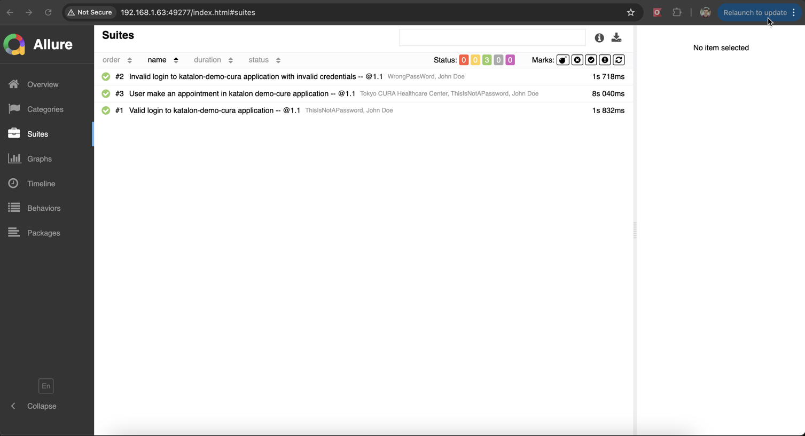
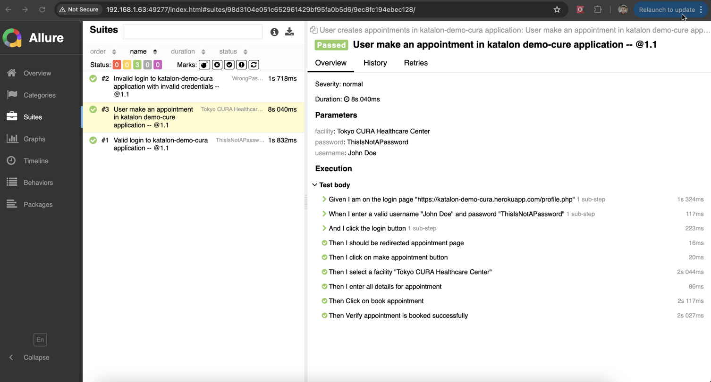
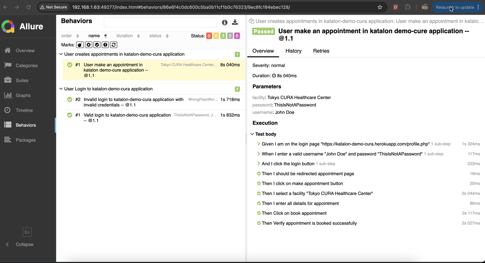
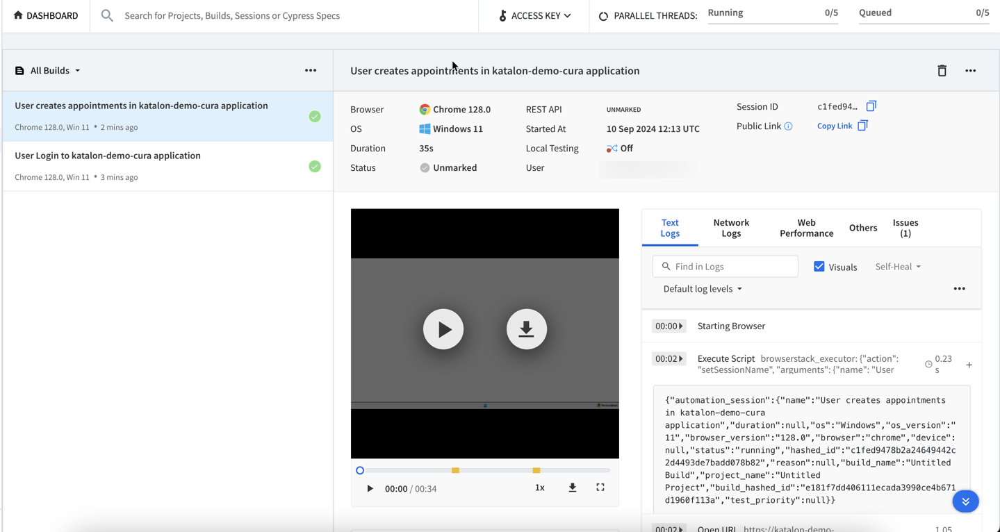

# Python Selenium Behave POM AllureReport
A Selenium automation framework built in Python using the BDD (Behavior-Driven Development) approach, using the Page Object Model (POM) design pattern, with integrated Allure reporting

This framework is built at a medium to high level to demonstrate the capabilities of an automation framework that can be developed using Python, incorporating Cucumber for BDD and the Page Object Model design pattern. It includes comprehensive test execution reporting, which can be shared with stakeholders to provide clear visibility into the test results and overall execution status.

The framework's folder structure primarily consists of a main folder with a Features directory inside, which includes feature files, pages, step definitions, and an environment file. However, it can be expanded to a more detailed structure when used in a real project.

## Web Automation Project

### Website Under Test

**Katalon Demo Cura** is a sample web application used to showcase basic health care appointment functionalities. The automated tests cover various user scenarios, such as login and booking appointments.

https://katalon-demo-cura.herokuapp.com/

### Scenarios Covered

1. **Login with valid credentials**  
   Automates the process of logging into the application with valid user credentials and verifies successful login.

2. **Login with invalid credentials and verify expected validation message**  
   Simulates logging into the application with invalid credentials and checks for the correct validation error message.

3. **Book a health care appointment with required details**  
   Automates the booking of a health care appointment by filling out the required fields and submitting the form.

### Quick Setup Steps

1. Clone the repository using Git.
`git clone https://github.com/hariprasadms/Python_Selenium_Behave_POM_AllureReport.git`
2. Ensure you have Python 3.9 or a newer version installed and 	Pip (Python package manager)
3. Install Behave for BDD testing
`pip install behave`
4. Install Selenium for browser automation: 
`pip install selenium`
5. Install WebDriver Manager to manage browser drivers:
`pip install webdriver-manager`
6. Install Pytest for additional testing functionalities:
`pip install pytest`
7. Optionally, install PyHamcrest for advanced assertion methods:
`pip install pyhamcrest`

### Run Tests with Behave

To run your tests, navigate to the project directory in your terminal and execute:

`behave`

### Generate Allure Reports

First, make sure Allure is installed on your machine. You can download Allure command line from its official website.
After installing, generate the report by running below.

`behave -f allure_behave.formatter:AllureFormatter -o features/reports`

To serve the report through a web link, run the command below. 
[ Note: Make sure to install Allure before running the command.
`brew install allure`]

`allure serve features/reports`

### Sample Test Run Report

Below is the test suite report generated after running all the tests. This was a simple run for demonstration purposes.

### Running on Browserstack 

1. Install browserstack sdk  `pip install browserstack-sdk`
2. To run automated tests using BrowserStack, we must provide a valid username and access key. This can be done adding browserstack userName and accesKey in the browserstack.yml file.
3. To run tests, run browserstack-sdk behave

